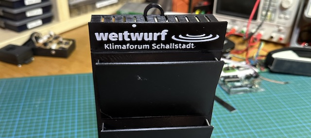

# An IoT Card Rack: cardRack

This is a project description showing how to build a 3D-printed card rack that signals how many slots are used over LTE-M. 

### Hardware

The IoT rack uses the IR sensors APDS-9930 for presence sensing and the AVR-IoT Cell Mini board EV70N78A by Microchip as the controller and LTE-M board. Since the sensors use all the same I2C address, they have to be on separate I2C buses. However, all in all, the hardware is very minimal, as one can see in the Fritzing sketch below. The Feather board is actually the mentioned EV70N78A board and not the Feather 328P. Since they have identical pin assignments and there is no Fritzing part for the former one,  I used the latter one.

### Software

The software is quite simple. An interrupt is triggered if a card is removed or inserted. Then the sensors are polled to check the number of used slots. Finally, a short message is sent via an HTTPS POST command to a webserver, where the number of occupied slots is stored by a CGI script. One can use the stored number in a Javascript script to display it on a web page. 

In order to monitor that everything is working, the AVR chip is woken up every 2 hours and the message with the number of occupied slots is sent. So, if the last received message is more than 3 hours old, the information will not be considered valid anymore.

### Folders

The repository contains the following folders:
* [3D](3D): The 3D data for printing all parts of the rack
* [IoTRack](IoTRack): The Arduino sketch
* [pics](pics): Some photos
* [schematic](schematic): A Fritzing schematic of the electronics
* [web](web): CGI script, an example bash script to trigger the CGI script, and an example web page 
